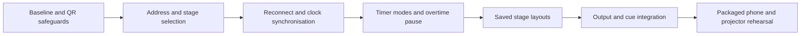

# Stage display, timers and mobile connections

Date: 2026-09-19. **Status reconciled 2026-09-22 against the tree, phase by phase.** Phases 0
to 4 have substantially shipped, phase 5 is half built and phase 6 has never been run. The
line below said phases 1, 2, 4, 5 and 6 "remain open" long after most of them stopped being
open, which is the same defect as a plan claiming no code had been written — a document
nobody can trust to say what is owed.

| Phase | State | Evidence |
|---|---|---|
| 0 · baseline and QR safeguards | **DONE** | as recorded below |
| 1 · the connection journey | **DONE** | `main.rs::network_addresses` (`sysprobe::NetworkAddress`); `Channels.svelte`'s `selectedStageId` → `stageRemoteUrl(lanIp, channels, selectedStageId)`; Refresh addresses with a named failure; the QR is keyed to its address (`qrOpen === c.id && qrUrl === address`) so a changed link cannot keep an old photograph; the build marker is `diagnostics::BUILD` (RG-209) |
| 2 · lifecycle and trustworthy time | **DONE** | reconnect backoff and single-socket enforcement (`stagereconnect.test.js`); `hostOffsetMs`, a median of five `beat_ack` samples, resampled on wake; `stale`/`staleForS` printing *not answering · Ns* after three unanswered beats; remote calls bounded by `AbortController` plus a deadline race |
| 3 · timer state and transport | **DONE but for one deferral** | pause through zero (§101), reset-to-configured (`Timer.configured_ms`), duration and count-down-to-local-time (§102), persistence across a relaunch (RG-208, §112). **Elapsed is still deferred** with the reason recorded in the phase |
| 4 · saved stage layouts | **SHIPPED, and NOT the way this phase said** | `stage_layouts` + `output_channels.stage_layout_id`, the Outputs editor, `stage_zones` on the wire, `timer_size` on the layout (RG-239 … RG-241). **DECISIONS §103 overruled this phase's "extend the existing template schema" instruction**: `stage.html` is a hand-drawn monitor, `Stage.svelte` renders no `TemplateRender` at all, and one table holding both would be two kinds of thing behind two renderers. Converging the renderers stays the coherent end state and is not a prerequisite |
| 5 · output and cue integration | **HALF** | RG-161 closed the per-screen half. **Stage-layout cue actions are still not built**, by this phase's own rule: add them after manual assignment is proven on a device, and no device has proven it |
| 6 · packaged rehearsal | **NOT RUN** | the script is `docs/qa/QA_HARNESS.md` Part 7 |

**What is genuinely still open**, and it is a short list: the elapsed timer (phase 3),
stage-layout cue actions (phase 5), and the rehearsal itself (phase 6). Everything phase 6
covers — a physical projector, a real phone, a 60-minute clock comparison — remains
**NOT TESTED**, and no claim in this document or the register substitutes for running it.

The status as written, 2026-09-19

Status: review and implementation plan; first mobile-link safeguards implemented locally. The complete upgrade is not implemented or validated on a physical device.

## Outcome and scope

Give the preacher a dependable phone, tablet or confidence display: current reading, next item, notes, messages and trustworthy clocks. Make connecting it understandable from Outputs. Bring the useful ProPresenter 7 stage and timer behaviours into Relay's existing offline architecture.

The user confirmed that the affected connection is the preacher's phone/tablet stage display, and asked to include both overtime-capable Pause/Resume and operator-saved stage layouts. They have not supplied the scan result, phone/browser, installed-versus-development build or network arrangement. The specific field failure therefore remains **NOT TESTED**, even where related defects are reproduced below.

Keep the existing Screen Countdown in the shell and the Stage Timer in Live. Preserve timer scopes, panic behaviour, rehearsal isolation, channel identity, template resolution and the shared renderer. Do not add a second output engine, cloud dependency, accounts, NDI or native SDI. ProPresenter is a behavioural reference; this work does not promise binary layout import or remote control of ProPresenter.

## ProPresenter reference, checked against official material

These support articles describe the requested features, but some were revised after the original ProPresenter 7 release. This is a documentation comparison, not a hands-on test of a particular ProPresenter build.

| Behaviour | ProPresenter reference | Relay direction |
|---|---|---|
| Current and next text, slide notes, screen previews, clocks and messages in editable layouts | [Stage screen guide](https://support.renewedvision.com/hc/en-us/articles/360041407794-Using-a-Stage-Screen-to-its-Full-Potential) | Save stage configurations through the existing template system. Start with the fields Relay already publishes. |
| Assign a layout to each stage screen; change a layout with a slide action | [Stage screen guide](https://support.renewedvision.com/hc/en-us/articles/360041407794-Using-a-Stage-Screen-to-its-Full-Potential) | Explicit per-screen assignment first. Cue-triggered layout changes follow only after manual switching is reliable. |
| Named countdown, countdown to a time of day, elapsed timer, reset and optional overrun | [Timer setup](https://support.renewedvision.com/hc/en-us/articles/360050782494-Setting-up-Timers-in-ProPresenter-7) | Extend `TimerRegistry`; distinguish timer mode from audience scope. Preserve current countdown defaults. |
| Timers bound to stage objects, time formatting, colour thresholds and conditional visibility | [Timers on stage screens](https://support.renewedvision.com/hc/en-us/articles/360053250613-Using-Timers-on-Stage-Screens) | Bind an explicit timer identity, add useful warning settings, and use one arithmetic/formatting path. Keep Relay's console colour meanings. |
| Separate timer state, appearance and audience presentation | [Audience countdown guide](https://support.renewedvision.com/hc/en-us/articles/360050786794-How-to-Create-a-Countdown-for-an-Audience-Screen) | Starting a stage clock must never take the congregation's content. Showing an audience countdown remains an explicit action. |

A fuller element and timer catalogue, gathered from the same official material plus the archived official user guide, is recorded separately in `docs/research/PROPRESENTER7_STAGE_AND_TIMERS.md`. Four points from it change nothing in this plan but correct the record:

- **ProPresenter has no QR pairing anywhere.** Its Remote app uses auto-discovery with a single password, and the legacy Remote Classic had separate controller and observer passwords. Relay's QR is its own idea, so there is no parity target for it and no external convention to match. It must be judged on whether a phone camera decodes it, which remains `NOT TESTED`.
- **Timers on a stage layout are not a distinct object type.** They are ordinary text boxes whose content is Linked Text bound to a timer. That is direct support for this plan's existing rule that phase 4 extends the template system rather than adding a competing stage renderer.
- **The three timer types are confirmed by the API's three mutually exclusive payload shapes**: Countdown (`duration`), Count Down To Time (`time_of_day` plus `am|pm|24_hour`), Elapsed Time (`start_time`, optional `end_time`). Relay has only the first. Overrun is a per-timer boolean and countdowns genuinely go negative.
- **On-screen timer colour is configured, not automatic** — Color Triggers map times to colours and the last colour persists through overrun. Relay's single warning threshold is a narrower feature, which is a defensible choice rather than an unfinished one, and should be recorded as such rather than quietly widened.

Defer screen-preview video, video time remaining, chord charts and Planning Center integration from this delivery. Each needs data or media plumbing beyond the reported defects. Record the reason and reopening condition, rather than calling these implemented or silently missing.

## Review findings

Evidence labels distinguish executed behaviour from source observations. Priorities describe service impact, not a claim that the user's exact failure is diagnosed.

| ID | Priority / status | Finding and evidence | Planned response |
|---|---|---|---|
| S1 | P1, reproduced; first fix tested | `Channels.svelte::onMount` substituted `localhost` when `local_ip` returned nothing; `channelroles.js::stageRemoteUrl` turned it into a phone link. Executing the helper returned `http://localhost:8032/stage.html?channel=2`. On a phone that address names the phone. | Suppress unavailable/loopback stage links, distinguish missing network from missing stage role, then add address refresh and interface selection. |
| S2 | P1, source-confirmed | Sharing chooses the first stage channel. For additional stage screens it directs the operator to Screens, whose `obsUrl` uses `outputUrl` and opens `output.html`. `Output.svelte` has no Stage Timer rail. A helper execution reproduced `output.html?channel=9` for the second stage. This is a valid general output URL, but the wrong journey for connecting another preacher tablet. | Let Sharing explicitly select any stage channel and give each its own `stage.html?channel=...` link. Keep the general output URL available and clearly named. |
| S3 | P1, source-confirmed limitation | `main.rs::local_ip` asks the OS for the route towards `8.8.8.8`; it does not enumerate local interfaces. Channels reads it once at mount. A VPN, multiple adapters, a network without a default route or an address change can defeat this choice. No packet is sent by the UDP connect operation. | Enumerate viable interfaces with a maintained cross-platform facility, show adapter/address selection and refresh, preserve a visible manual choice, and never claim remote reachability from a local address alone. |
| S4 | P2, first fix tested; camera scan NOT TESTED | Stage QR generation used `margin: 1`, generated 200 pixels and displayed 150. Failure only reached `console.warn`. The QR library documents a default four-module quiet zone, checked through Context7 against [node-qrcode](https://github.com/soldair/node-qrcode#options). | First repair uses four modules, 240 generated/displayed pixels, visible failure and copy-link recovery. Verify decoding and real cameras before claiming scan reliability. Audit the separate general-output QR in phase 1 too. |
| S5 | P1, source-confirmed coverage gap; **closed** | `Stage.svelte::connect` sets `connected` on socket open, with no application-state acknowledgement or shared output heartbeat. Reconnect happens after close/error; an apparently open but unresponsive socket is not detected by a deadline. `Output.svelte` uses the existing health mechanism. | Fixed with S6, by one frame. The hub answers each `beat` with `{"kind":"beat_ack","at":<host epoch ms>}`, to that one client. Three unanswered beats (`BEAT_INTERVAL_MS * 3`) means stale, and the header says `not answering` rather than `live`. Silence alone could not have detected it: the hub publishes only when something changes, so no frames is the normal state of a quiet service — but an unanswered beat is different, because the page knows it asked. |
| S6 | P1, arithmetic reproduced; **closed** | Stage subtracts its own `Date.now()` from the computer's epoch deadline. A synthetic phone clock 60 seconds ahead showed four minutes where the computer showed five. There is no clock offset protocol in the inspected sources. This is not a measured physical-device drift rate. | Fixed. The same ack carries the host epoch, so the correction rides a round trip that was already happening. The offset is the MEDIAN of the last five samples, so one slow round trip is a latency measurement rather than a clock change. One corrected instant drives the wall clock, the countdown mirror, the programme rail and the service-elapsed figure, so they cannot disagree with each other. The offset is short by the return leg — single-digit milliseconds on a LAN against a figure displayed to the second — and that is stated at the call site rather than presented as sub-second sync. |
| S7 | P2, recorded gap; **closed** | `TimerRegistry::adjust` rejects less than one second, using a zero-clamped remaining value. Live exposes Start, Stop and +5; it cannot pause a stage timer through zero. Already recorded as RG-175 and DECISIONS §99, not a newly discovered regression. | Fixed, DECISIONS §101. The held figure is signed; the audience guarantee moved from "the contract is positive" to the same clamp a running countdown already had, so a wall still cannot show a negative. `adjust` distinguishes a REQUESTED length (floor still enforced, both scopes, so `+5` and `-1` are unchanged) from a READING it takes itself when the caller is only holding — the latter may be negative on the stage. Live gained the Hold/Resume control, which names no figure because its own reading is clamped. Four layers, three of which could have been fixed with the feature still broken. |
| S8 | P2, existing design constraint; **closed** | `Stage.svelte::loadZones` stores layout choices on the device. The operator cannot assign or inspect those choices. Layer templates already have stage-related bindings and starters in `layers.js`, so a fresh independent editor would duplicate existing facilities. | Done as DECISIONS §103, and **deviating from "using Templates" deliberately**: a stage layout has no regions, no style and no `TemplateRender` output, and the template-rendered surface cannot show a Stage Timer at all (`timer: false` for `Output.svelte`). Own table, global list, per-screen assignment — ProPresenter's own shape. Device settings are preserved by construction: NULL is the default and the fallback, nothing is migrated, and clearing an assignment hands the screen back. The layout EDITOR now exists too — Outputs gains a **Stage layouts** section: create, rename, re-zone, delete. A zone toggle does NOT write through, because it would change what a preacher is looking at on every tap while the operator is still deciding; Save is the moment it reaches a screen and the editor says when something is unsaved. Two refusals, both about a change that would not stay done or not stay visible: a layout a screen wears names the screens, and a shipped starter cannot be deleted because the seed would restore it on the next launch. |
| S9 | P2, source-confirmed; **closed** | Stage control requests have no deadline/abort; a request which never settles can keep `busy` true. Navigation catch text can look like a passage boundary even when transport failed. | Fixed. `api()` races a six-second deadline against the fetch and aborts the controller — two mechanisms because they guarantee different things: the abort releases the socket, the race is what returns the panel's buttons even on a webview whose `fetch` ignores `signal`. A `NoAnswer` error distinguishes no reply from a refusal, so a transport failure no longer borrows the words of a correct passage boundary and never claims the wall did not move — the request may have executed with only the reply lost. Nothing retries on its own. Read-only `search` keeps its plain wording, because a failed search moved nothing. |
| S10 | P2, source-confirmed | The mobile timer rail intentionally limits what fits, using `programme` and the overflow entry in `Stage.svelte`. Having multiple registry timers does not guarantee the wanted timer is visible. | Saved layout chooses a primary timer and secondary timers, with explicit overflow. Test long names, large digits and small screens. |
| S11 | P1, reproduced; **closed** | `Stage.svelte` sends exactly one message for its whole lifetime — the `hello` at line 893. It never sends `beat`, which `Output.svelte` sends every two seconds via `startBeat` (`Output.svelte:18,932`). So `OutputHealth` holds `last_beat_ms == null` for a stage channel forever and `describeStageReach` reports a correctly wired tablet as one that "has never reported painting". This is the console's view of the connection, where S5 is the phone's. | Fixed. `Stage.svelte` now calls the same `startBeat` every other output page calls, passing `getWs` — which that function already accepts precisely because a kiosk client has a socket and no bridge. No new frame kind, no new protocol and **no Rust change**: the hub has read `channel` and `state` off an inbound `beat` since the mechanism shipped (`channels.rs:2710`). Channel 0 is refused inside `startBeat`, so an unidentified page cannot attach health to a screen nobody chose. |
| S12 | P2, reproduced; **closed in this slice** | The Screens inspector's Show QR had no loopback guard, so with no usable address it generated a QR encoding `http://localhost:8032/output.html?channel=2&name=Stage%20display` — the same defect as S1, on the door S1's own fix did not touch. Reproduced by a mounted test before the repair. | Fixed. `isSharableHost` is now one exported, named predicate in `channelroles.js` used by both doors. The output URL and Copy URL are deliberately unchanged, because a loopback output address is correct for OBS on this computer; only the photograph is refused, since a QR is a second device by definition. |
| S13 | P2, development-time only; **closed 2026-09-21** (RG-209): `diagnostics::BUILD` is stamped by `build.rs`, printed at boot, written on every `services` row and shown on Settings → This machine | `networkAddresses()` is written to throw, and `refreshNetwork` awaits it inside `Promise.all`, so a backend that does not register `network_addresses` fails the whole resolve and the Sharing pane offers no link at all — even though `local_ip` would have answered. A shipped build cannot diverge this way; a working tree whose binary predates the command can, and did (the built binary was older than `main.rs`). | Leave the throwing contract intact: a failed refresh must not look successful. Address it instead with phase 1's build/version marker, so a stale development build is identified rather than inferred from a blank panel. |
| S14 (closed 2026-09-21, RG-194: `Output.svelte` reads `beat_ack` and hands `hostOffsetMs` to `TemplateRender`) | P2, recorded, not fixed | `Output.svelte` does not read `beat_ack`, so a congregation screen's countdown is still computed against its own clock. In the common case it is the native window on the same machine, where the skew is zero by construction — but a kiosk browser source on a SECOND computer has exactly the exposure S6 describes, and a wrong countdown on the wall is seen by more people than a wrong one on the preacher's phone. | Thread the offset into `TemplateRender`, which ticks its own `Date.now()` and is the shared renderer for the wall. Its own slice, with its own tests, because it changes what a congregation sees. The verdict table in `r6-contracts.test.js` carries an explicit `beat_ack: false` for that page with this reason, so it cannot be forgotten quietly. |

### Behaviour already present, preserve it

- The registry separates `Scope::Both` and `Scope::Stage`. A stage clock survives ordinary content changes and congregation panic controls. Stage messages do not survive panic.
- The stage page sends a channel-keyed `hello`. The hub replays retained screen state and timer state. An old stage alert is deliberately not replayed.
- Channel role gates stage messages. A channel ID prevents accidental assignment; it is not authentication.
- Audience look resolution, per-content looks, screen clear/black/restore and template rendering already exist. Extend those paths, do not replace them with stage-specific rendering branches.
- Live displays overtime and supports a +5 grant. These are recent fixes, not work still to build. Audience countdown controls already have their own transport.
- The LAN HTTP remote deliberately permits control on the trusted LAN, with mutating operations using POST. This plan does not silently change that recorded security model or weaken Origin/CSP checks to get a connection working.

Relevant existing decisions: `DECISIONS.md` §§35, 39, 64, 68, 89, 91, 92, 95, 97, 98 and 99. Existing test inventory: `docs/qa/QA_HARNESS.md` Part 4.

## Target journeys

### Connect the preacher

1. Outputs → Sharing → choose the stage screen by name. If none exists, offer the existing create/role-assignment path.
2. Choose a detected LAN address. Show the selected adapter, address and refresh action; explain when none is usable.
3. Show one consistent URL, QR and Copy link action for that stage channel. Invalidate an open QR when its URL changes.
4. The phone opens the locally served stage page, receives current state and identifies the selected screen.
5. Outputs reports the device's recent heartbeat separately from content delivery. The phone reports stale/reconnecting state visibly.
6. Lock/unlock or brief Wi-Fi loss restores the current verse, timers and channel configuration without reviving an old alert or undoing a blackout.

### Run a sermon timer

1. Live → Stage Timer → select a saved timer or enter name and duration.
2. Start changes only stage timer state. The audience continues showing its existing content.
3. Pause freezes the displayed value, including overtime. Resume continues from that value. +5 retains its current documented meaning after zero.
4. Reset is distinct from Stop and has a clearly displayed consequence. A timer tied to a cue follows the existing cue/service retirement rules.
5. Operator and preacher see the same time, hold state and overrun state. The operator sees which assigned layouts can display the timer, without claiming a person has read it.

### Prepare a stage layout

1. Templates → stage starter: Preacher, Reading + Next, Timer Focus or Confidence Monitor.
2. Configure current reading/reference, next, cue note, message, clock, service elapsed and chosen timer bindings.
3. Save locally, preview at phone portrait/tablet landscape/monitor sizes and assign to a named stage channel.
4. Switch layouts without resetting timers or replacing congregation content. Keep alerts readable over every layout and preserve panic behaviour.

## Implementation sequence

Each phase is a small PR with its own acceptance criteria. Dependencies are sequential: connection correctness before mobile trust, clock semantics before new timer controls, shared bindings before layout editing. No public push, merge or release is implied by this local plan.

### Phase 0: baseline and first safeguards

Status: review completed; initial local repair implemented, verification recorded below.

- Read existing decisions and tests, reproduce URL and clock problems without church data.
- Add the missing-network state and prevent mobile loopback URLs.
- Improve stage QR sizing/quiet zone and surface generation failure.
- Associate a generated QR with its URL so a changed link cannot keep displaying the old QR.
- Keep a copy-link fallback. Do not claim this identifies the user's physical failure.

### Phase 1: complete the connection journey

Files: `main.rs::local_ip`, `capture.js::localIp`, `channelroles.js::stageRemoteUrl`, `outputurl.js`, `Channels.svelte`, existing readiness probes, URL/component tests.

- Introduce one network-address result carrying candidates, selected address and reason when none is usable. Audit every `local_ip` caller, including media URL construction and boot probes, before changing the existing command contract.
- Add explicit stage selection in Sharing, retaining the first stage as the initial default. Never silently change the meaning of general `output.html` links.
- Add Refresh and handle IP changes, no route, offline LAN and VPN/multiple adapters. A loopback URL may remain useful for OBS on the same computer; do not reject it globally as a mobile fix.
- Make general-output QR generation errors visible too; audit its size, quiet zone and stale image behaviour.
- Diagnose HTTP page availability and WebSocket availability separately through the existing probes. Do not install firewall rules or disable platform protection automatically.
- Add a build/version marker to diagnostics so installed and development output assets can be distinguished. Verify `:8032` serves the expected packaged assets; a Vite page alone is not the application backend.

Acceptance: selecting either of two stage screens produces and decodes the correct stage URL; QR, text and clipboard agree; no valid mobile address produces an actionable explanation; QR failure is visible; changing selection/address invalidates the image; local OBS still works.

### Phase 2: connection lifecycle and trustworthy time

Files: `Stage.svelte`, `Output.svelte`, `outputHealth.js`, `channels.rs::run_kiosk_server`, existing hub/remote tests and `e2e.rs`.

- Reuse the existing screen heartbeat and define a state-ready response. Extend channel/device reporting without putting transcript or verse text into diagnostics.
- ~~Add bounded liveness checks, reconnect backoff and cancellation on destroy. Reconnect on resume/visibility restoration when stale; prevent duplicate sockets/listeners.~~ **Done.** The retry doubles from 1 s to a 20 s cap; `visibilitychange` and `online` abandon the wait, which is what makes the backoff acceptable — the long delays belong to a page nobody is looking at. A stale socket is force-closed on wake, because a half-open socket never fires `onclose` and the retry path is otherwise unreachable. One socket at a time, enforced three ways: `connect` refuses while one is CONNECTING or OPEN, every handler checks it has not been superseded, and the pending retry is cleared before a new socket is opened. Destroy clears the timer and both listeners. `stagereconnect.test.js`, 4 of its 8 watched to fail against the flat-rate page.
- Add host-time samples and a shared offset calculation. Duration timers should resist wall-clock jumps; countdown-to-time intentionally follows the selected host time-of-day policy. Resynchronise after sleep.
- Show last-update age and stale state. Keep the last reading visible with a warning while disconnected; do not falsely advance content.
- Bound remote API requests. A timeout after a mutating request is an uncertain outcome, not proof that nothing fired; fetch current state before offering another action.

Acceptance: disconnect/reconnect restores state; half-open connections become stale; ±60-second client clock skew does not change displayed timer values after synchronisation; repeated mount/unmount leaves one connection; no action is duplicated after a timeout. Proposed connected-device skew target: at most one second after synchronisation, verified rather than assumed.

### Phase 3: timer state and transport

Files: `timers.rs`, timer commands in `main.rs`, `capture.js`, `countdown.js`, `timers.js`, `layers.js`, `Live.svelte`, `Dock.svelte`, `Stage.svelte`, `e2e.rs`.

- ~~First implement stage Pause/Resume through zero. Represent a held stage value as signed milliseconds. Audit zero/null checks, formatting, warnings, projections, retained frames and all adjust callers.~~ **Done** (DECISIONS §101). The null audit mattered most: `Number(null)` is `0`, so the old `held > 0` was rejecting an unheld timer by arithmetic rather than by intent — widening it to "is it finite" without an explicit null guard freezes every unheld countdown in the product at `0:00`. Pinned by `countdown.test.js`'s three-case null table.
- Preserve positive audience holds and done-message behaviour. Pausing at `+2:00 over` must hold that figure, then resume at `+2:01 over`, rather than reset or refuse it.
- ~~Add reset-to-configured-value semantics without accidentally deleting the timer. Keep Stop explicitly distinct. Preserve +5 and scope/service/rehearsal retirement rules.~~ **Done.** There was no configured length to go back to: `from_ms` is never re-stamped but `target_ms` is, so `target_ms - from_ms` grows by five minutes on every `+5` — the right span for the warning rule and useless as "the length somebody chose". `Timer.configured_ms` now carries it, `serde(default)` with `start` filling a zero from the span, so a hand-built or older row still has a usable one rather than resetting the clock to nothing. `reset` answers HOW LONG and never running-or-not: a held timer is reset where it stands and stays held, because resuming as a side effect would start a clock nobody asked to start. Stop is untouched and `reset` cannot delete or create a timer.
- ~~Then introduce explicit timer modes: countdown duration, countdown to local time and elapsed.~~ **Two of three done** (DECISIONS §102). Duration and count-down-to-local-time ship; `until_ms` is a second configuration field rather than a mode flag over `configured_ms`, because Reset restores a LENGTH for one and an INSTANT for the other. **Elapsed is deferred with a reason**: `layers.js`'s `elapsed` binding already gives a service-elapsed figure from `service_started_at`, and a named elapsed timer in the registry is a different instrument wanting its own design rather than a third arm here.
- ~~Support names, presets, chosen warning thresholds and overrun policy. Define midnight, timezone/DST, restart and system-sleep behaviour before adding the time-of-day mode.~~ **Names and thresholds already existed; presets and per-timer overrun policy are declined for now** — overrun is always on because §99 and §101 made counting up the behaviour of every timer, and a per-timer switch would be a second answer to a settled question. **DST and midnight were defined before the mode was built**, which is why `atClockTime` is on the frontend: `std` has no timezone, the project has no `chrono`, and `Date.setHours` is DST-correct by construction. **A time already gone is kept rather than rolled to tomorrow** — the operator's decision, recorded in §102 and pinned by `countdown.test.js`. **Restart and system sleep are NOT addressed**: the registry is still in memory, so a relaunch loses every clock, appointment or not. That is the largest open thing left in this area.
- Keep the timer engine authoritative; surfaces project its state through shared calculations. New modes must not gain direct content construction outside `pipeline::Fire`.

Acceptance: running/held/expired/overtime/reset transitions pass through backend commands and mounted controls; operator, phone and output projections agree; no stage operation changes congregation content; both panic keys and rehearsal exit retain their established scope rules; cue changes retire only the intended timers.

### Phase 4: saved stage layouts

Files: existing template database/model, `layers.js`, `TemplateRender.svelte`, Templates editor, channel assignment, Stage adapter and relevant template/output tests.

- Record the approved product direction in `DECISIONS.md` when the concrete model is implemented. Extend the existing template schema and bindings; do not introduce a competing stage renderer or a second editor.
- Supply stage data as a typed render context: current/next/note/message/service clock/timer selection. Keep private messages out of general content fields and enforce existing role checks at receivers.
- Persist layouts locally and assign them per channel. Keep device preferences as a legacy fallback until the operator selects a saved layout; do not silently erase them.
- Provide responsive presets and preview using the actual renderer. Define how a primary timer is chosen and how additional timers are summarised.
- Preserve current look resolution for congregation channels. A stage layout switch cannot change an audience look or reset a timer.
- If a database migration is necessary, make it retryable and test upgrade from the maintained baseline. Prefer existing extensible template JSON where it fits the real model.

Acceptance: save/reopen/restart retains the layout; two stage devices can have different assignments; switching layouts preserves the reading and timer state; a non-stage channel does not gain private messages; long scripture and overtime remain legible in portrait and landscape.

### Phase 5: output and cue integration

**RG-161 is closed** (two commits: the plumbing, then the writer). A cue names
its screens; an untargeted screen is UNTOUCHED, not cleared. Stage-layout cue
actions are still NOT built — the plan says to add them only after manual
assignment is proven, and no device has proven it.

- Verify native window, browser source and mobile stage as separate consumers of the same state. Keep browser-source URL, look and channel identity coherent.
- Wire existing cue timer actions to the richer timer state. Add stage-layout cue actions only after manual assignment is proven; preview/rehearsal must not switch real screens.
- Exercise physical display disconnect/reconnect, per-screen clear/black/restore, template changes, current-state replay and shared health reporting.
- Document what a stage template on `output.html` shows versus the mobile stage view. Remove misleading setup guidance rather than hiding capability differences.

Acceptance: a cue may change the intended stage layout/timer without touching an unrelated audience screen; channel-specific restore is correct; reconnect cannot revive cleared content; all new publishers are included in WebSocket and desktop E2E assertions.

### Phase 6: packaged rehearsal and operator acceptance

**The script exists: [`../../qa/QA_HARNESS.md` Part 7](../../qa/QA_HARNESS.md) (it was `docs/qa/STAGE_PHONE_REHEARSAL.md`, a path that no longer exists, until it was folded into the harness on 2026-09-21).**
Twelve numbered sections, in dependency order, each saying what to expect and what to record
when it does not happen. It opens with the build step because a binary predating
`network_addresses` reproduces the very defect it is meant to test (S13), and it ends with
what a useful report back looks like. It is NOT RUN.

- Build the actual Tauri bundle; verify its CSP, stage assets, local HTTP and WebSocket services.
- Use a physical iPhone/iPad Safari and Android Chrome where available, on the same LAN as the computer. Record OS, browser, Relay build and network topology without copying credentials.
- Scan each QR from the operator's screen. Test first join, second device, app restart, device lock/unlock, portrait/landscape, Wi-Fi interruption and IP refresh.
- Run a stage timer through zero, pause/resume it, extend it and reset it. Compare the operator and device readings over a 60-minute rehearsal.
- Test a long reading, cue note, next item, message, clear, blackout and restore. Verify that the congregation display receives no private stage message.
- Test one real projector/HDMI output and the actual OBS/browser-source setup if used. A passing browser test cannot certify a physical wall.

Acceptance: record visible results and failures. No general-release claim from this work alone; the repository's existing supervised-pilot decision remains in force.

**Timer persistence — done 2026-09-21** (RG-208, DECISIONS §112). `TimerRegistry` writes every change to a `timers` table on its own thread and a relaunch restores the rows: the stage is told, a congregation countdown is offered on Live for Put back. This was the largest open item in this area.

## Decisions and compatibility

The user's approval covers including signed overtime Pause/Resume and saved layouts. The following are the proposed concrete contracts, not silently enacted architecture changes:

- **Overtime hold:** existing DECISIONS §99/RG-175 left signed hold unresolved. A signed stage hold makes Pause consistent before and after zero. Cost: audit every reader and keep audience projections clamped. Evidence required: backend E2E and both operator/mobile mounted tests at zero and on either side.
- **Saved layouts:** existing stage preferences are device-local. Add an explicitly selected operator-owned template, preserving old settings as fallback. Benefit: predictable preparation and assignment. Cost: migration/precedence and responsive previews. Evidence required: restart, two-device assignment, rollback and role-isolation tests.
- **Extra modes and cue layout actions:** useful ProPresenter behaviours, scheduled after the above. Define exact restart/time-of-day/automation semantics in a decision entry before implementation. They are not a reason to delay connection repairs.
- **LAN trust:** retain DECISIONS §35. Pairing or new authentication would need its own explicit proposal. Never describe a channel ID or QR as a credential.

## Verification and current delivery

**These are the figures of 2026-09-19 and they are kept as a record, not as a claim about the
tree today.** A frozen verification block is evidence of what was run that day; the counts have
moved a long way since (`npx vitest run` and `cd src-tauri && cargo test` print the current
ones, and `docs/qa/QA_HARNESS.md` §0 is the register that carries values beside the command
that produces them). Do not update the numbers below — read them as dated.

Initial code repair: `channelroles.js::stageRemoteUrl`, `Channels.svelte::showStageQr` and Sharing markup; regressions in `stageremote.test.js`. No Rust behaviour or database schema changed in this first repair.

- **PASS:** baseline `npm test`, 195 files and 2,874 tests, command output from this session.
- **PASS:** focused baseline covering stage, timers, URLs, reconnect and health, 10 files and 170 tests.
- **PASS:** repaired `npx vitest run src/lib/stageremote.test.js`, 16 tests.
- **PASS:** defect reintroduction check. Running those tests with the two original implementation files restored produced 10 failures and six passes. The repaired files were then restored.
- **PASS:** `cargo test e2e -- --test-threads=1`, 93 passed, zero failed, one ignored audio benchmark requiring external fixtures. The broad filter also matches that benchmark; this does not mean an E2E service-safety test was ignored.
- **PASS:** initial `npm run build` and `cargo fmt --all -- --check`. Existing Svelte unused-selector warnings remain.
- **PASS:** final `npm test`, 195 files and 2,884 tests; `npm run build`; `cargo clippy --all-targets -- -D warnings`; `git diff --check`.
- **PASS:** approved unrestricted `cargo test`, 909 passed, zero failed, 16 ignored benchmarks. The initial restricted run had 881 passed, 28 failed and 16 ignored because the sandbox refused local socket creation. The unrestricted rerun exercised those HTTP/WebSocket tests successfully.
- **PASS:** actual `qrcode` generation with the new options produced a 240×240 PNG. This checks generation, not camera decoding.
- **NOT TESTED:** physical QR decoding/scanning, installed-app CSP, real phone/tablet connections, VPN/multiple-interface reproduction, actual display pixels and 60-minute synchronisation. No app was listening on local port 8032 during the initial listener check. Source inspection and mocked DOM tests do not establish these outcomes.

Rollback for the first repair: revert its local source/test changes together; no data migration is involved. For subsequent schema work, take and test a local database backup before a packaged upgrade, and document whether an older binary can read it. Keep each PR independently reviewable.

Next implementation slice, **as reconciled on 2026-09-22**: phase 1's address refresh and
stage-channel selection are built (see the table at the top), so the next thing is the one
that has not moved since this was written — **reproduce the user's actual scan/connect
failure on the installed app**. That is phase 6, and no amount of further building
substitutes for it. The scan result, phone, browser, build and network arrangement are still
not supplied, so the original field failure remains **NOT TESTED**.

## Open questions inherited from the 2026-09-19 design

Carried here on 2026-09-21 when `specs/2026-09-19-stage-planner-media-propresenter-design.md` was archived (its sub-projects shipped on 2026-09-20; see RG-161 to RG-177, DECISIONS §104, §105). These are the things it said it would not decide, and nothing has decided them since:

- How a countdown is started when there is no plan (3a).
- Which of the three numbering changes the operator meant (5a).
- Whether media transport ships without a reverse channel. The recommendation is
  that it does not, and that is a recommendation rather than a decision.
- Anything covered by this plan's own phases. **That list was reconciled against the
  tree on 2026-09-22 and is now short**: the elapsed timer (phase 3), stage-layout cue
  actions (phase 5) and the rehearsal (phase 6). It used to read "phases 1, 2, 4, 5 and 6
  remain open", which was true when it was written and stayed on the page for three days
  after most of them shipped. Phase 6 is the one that has not moved at all: a written
  rehearsal script that has never been run, and no claim here about a physical stage TV, a
  phone or a projector can be made until it is.

Also still open from that design: 4e click semantics (contradicted by DECISIONS §81 on the run surface, so it needs a ruling rather than a build), 5c playlists into plans, 5e media import (BLOCKED on the church's media folder), and the elapsed timer.
